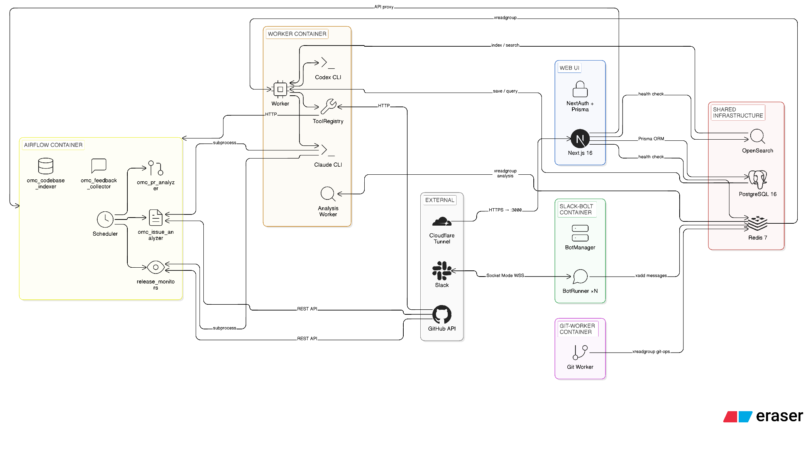

# CustomClaw — AI Slack Bot Management Platform

> **AI Agent?** → See [FOR-AGENTS.md](FOR-AGENTS.md) for automated setup instructions.

[한국어](README.md) | [Architecture](docs/architecture.en.md)

CustomClaw is a self-hosted platform for creating and managing multiple AI-powered Slack bots. Each bot connects to Slack via Socket Mode, processes messages through a Redis Stream queue, and responds using Claude CLI or Codex CLI as its LLM backend — with persistent RAG memory across conversations.

---

## Key Features

- **Multi-bot management** — Run any number of independent Slack bots from a single deployment, each with its own persona, model, and tool configuration
- **Multi-provider LLM** — Choose Claude CLI (Anthropic) or Codex CLI (OpenAI) per bot; supports full-agent agentic mode
- **RAG memory** — Hybrid search (pgvector cosine similarity + OpenSearch nori BM25) gives every bot long-term memory across sessions
- **Built-in tools** — Each bot can invoke GitHub issue management, Airflow DAG control, code search, and bot CRUD operations
- **Web UI** — Next.js dashboard for bot creation/editing, real-time monitoring, and Airflow DAG management
- **Airflow DAGs** — Automated workflows: GitHub issue AI analysis, PR consistency analysis, feedback collection, codebase RAG indexing, and release monitoring for Claude Code and GPT Codex
- **Automated PR analysis** — Claude-powered consistency analysis triggered on PR creation, with Slack-threaded progress notifications
- **Feedback collection** — Anonymous feedback submission through GitHub Actions → Airflow DAG → GitHub issue creation
- **API usage tracking** — Automatic token (input/output/cache) and cost recording for every Claude CLI call, with period-filtered dashboard views
- **Documentation drift detection** — Daily monitoring of Claude Code and Codex official documentation for structural changes, with impact analysis and automatic issue creation
- **Process supervision** — Managed restarts via supervisor process with Redis-based restart signaling
- **Git worker** — Dedicated Redis Stream consumer for async Git operations
- **Flexible deployment** — Direct IP access, reverse proxy (Nginx/Caddy), or Cloudflare Tunnel for public exposure

---

## Tech Stack

| Category | Technology |
|----------|-----------|
| Slack integration | Slack Bolt (Python), Socket Mode |
| Message queue | Redis 7 Streams (consumer groups) |
| LLM providers | Claude Code CLI (Anthropic), Codex CLI (OpenAI) |
| Vector store | PostgreSQL 16 + pgvector (HNSW index, 1024-dim) |
| Full-text search | OpenSearch 2.x + nori analyzer |
| Embeddings | Voyage AI API (optional) |
| Workflow orchestration | Apache Airflow 3.x |
| Web UI | Next.js 16, React 19, Tailwind CSS 4, shadcn/ui |
| Auth | NextAuth v5, GitHub OAuth |
| ORM | Prisma 7 |
| Database | PostgreSQL 16 |
| Cache / queue | Redis 7 |
| Containerization | Docker Compose |
| Ingress | Direct IP / Reverse Proxy / Cloudflare Tunnel |

---

## Quick Start

### Prerequisites

- Docker and Docker Compose
- [uv](https://docs.astral.sh/uv/) (recommended) or Python 3.12+
- Claude CLI installed on the host (authenticated via `~/.claude`) — required if using the `claude` provider
- Codex CLI installed via npm (`npm install -g @openai/codex`) — optional, for the `codex` provider
- A GitHub OAuth App (for Web UI login)
- Voyage AI API key (optional, for embeddings)

### 1. Setup and launch

```bash
git clone https://github.com/baekenough/customclaw.git
cd customclaw
uv run setup.py
```

The interactive CLI guides you through:
1. **Environment configuration** — database, API keys, Slack tokens, host paths → generates `.env`
2. **First bot creation** — bot name, persona, LLM provider → generates `bots/*.yaml`
3. **Service launch** — runs `docker compose up -d` automatically

### 2. Verify

```bash
# Check service status
docker compose ps

# Follow bot logs
docker compose logs -f slack-bolt worker
```

Open [http://localhost:3000](http://localhost:3000) and sign in with GitHub OAuth.

---

## Project Structure

```
customclaw/
├── .github/
│   ├── workflows/               # GitHub Actions workflows
│   │   ├── issue-analyzer.yml   # Auto-trigger issue analysis
│   │   ├── pr-analysis.yml      # Auto-trigger PR analysis
│   │   └── feedback-submission.yml  # Manual feedback submission
│   ├── ISSUE_TEMPLATE/          # Issue templates (bug, feature)
│   └── PULL_REQUEST_TEMPLATE.md
├── setup.py                     # Interactive setup CLI
├── bots/                        # Bot YAML configurations (user-defined)
│   └── example.yaml             # Example bot config template
├── dags/                        # Airflow DAG files (user-defined)
│   └── example_hello_world.py   # Example DAG
├── docker/                      # Dockerfiles and entrypoints
│   ├── airflow/
│   ├── opensearch/
│   ├── slack-bolt/
│   └── web-ui/
├── migrations/                  # PostgreSQL schema migrations
│   └── 001_initial.sql
├── slack_bot/                   # Core Python package
│   ├── app.py                   # BotManager — loads bots, manages Socket Mode threads
│   ├── worker.py                # Redis Stream consumer — invokes Claude/Codex CLI
│   ├── analysis_worker.py       # Dedicated analysis Redis Stream consumer
│   ├── supervisor.py            # Process supervisor for managed restarts
│   ├── runtime_control.py       # Runtime control helpers (Redis-based restart)
│   ├── git_worker.py            # Redis Stream consumer — handles async Git operations
│   ├── bot_runner.py            # Per-bot Slack event handler and stream producer
│   ├── config/
│   │   └── loader.py            # YAML bot config loader (BotConfig dataclass)
│   ├── memory/
│   │   ├── store.py             # Message persistence (PostgreSQL)
│   │   ├── extractor.py         # Long-term memory extraction (Voyage embeddings)
│   │   ├── search.py            # Hybrid search (pgvector + OpenSearch)
│   │   └── opensearch_client.py # OpenSearch nori index management
│   └── tools/
│       ├── base.py              # ToolRegistry base class
│       ├── github_tools.py      # GitHub issue creation and query tools
│       ├── airflow_tools.py     # DAG status, run history, and trigger tools
│       ├── code_tools.py        # Codebase search tool
│       └── bot_management_tools.py  # Bot CRUD tools
├── web-ui/                      # Next.js 16 frontend
│   └── src/app/
│       ├── (auth)/              # Authenticated routes
│       └── login/               # GitHub OAuth login page
└── docker-compose.yml
```

---

## Web UI

Access the dashboard at `http://localhost:3000` after signing in with GitHub OAuth.

| Page | Path | Description |
|------|------|-------------|
| Dashboard | `/` | Service health, bot call statistics, daily activity charts, token/cost tracking with period filters |
| Bot List | `/bots` | View and manage all registered bots |
| Create Bot | `/bots/new` | Add a new bot with YAML-based configuration form |
| Bot Detail | `/bots/[id]` | Edit bot settings, view conversation stats |
| Airflow | `/airflow` | Browse DAGs, trigger runs, view run history |
| Monitoring | `/monitoring` | API usage logs, token consumption, cost tracking |

---

## Bot Configuration

Each bot is defined by a YAML file in `bots/`. The platform loads all `*.yaml` files from that directory at startup. Tokens can reference environment variables using `${ENV_VAR}` syntax.

```yaml
name: my-bot                       # Unique bot ID

slack:
  app_token: ${MY_BOT_APP_TOKEN}   # xapp-... Socket Mode token
  bot_token: ${MY_BOT_BOT_TOKEN}   # xoxb-... Bot OAuth token
  channels: []                      # Restrict to specific channel IDs (empty = all)

persona:
  display_name: "My Bot"
  description: "What this bot does"
  personality: |
    You are a helpful assistant for the engineering team.
    Keep responses concise.

claude:
  provider: claude      # "claude" or "codex"
  model: sonnet         # claude: sonnet/opus/haiku | codex: gpt-5.4
  max_turns: 10         # Max agentic turns per message
  full_agent: false     # Enable full agentic mode (tool use across turns)

memory:
  context_window: 20    # Number of recent messages to include in context
  auto_extract: true    # Automatically extract long-term memories

project:
  repo_path: ""         # Absolute path to a local repo (for code search)
  github_repo: ""       # owner/repo for GitHub tools
  github_token_var: GITHUB_TOKEN

airflow:
  dag_prefix: ""        # Filter DAGs by prefix

tools:
  enabled:
    - create_bot
    - list_bots
    - update_bot
    - delete_bot
    - get_dag_status
    - list_dags
    - list_dag_runs
    - trigger_dag

security:
  allowed_channels: []  # Restrict bot to specific channels (empty = all)
  allowed_users: []     # Restrict to specific Slack user IDs (empty = all)
  dangerous_tools:      # Tools requiring implicit confirmation
    - delete_bot
    - trigger_dag
```

### Creating a Slack App

Before adding a new bot, create a Slack App at [api.slack.com/apps](https://api.slack.com/apps):

1. Create app → **From scratch**
2. Enable **Socket Mode** → generate an App-Level Token (`xapp-...`)
3. **OAuth & Permissions** → add Bot Token Scopes: `chat:write`, `reactions:write`, `reactions:read`, `channels:history`, `channels:read`
4. Install to Workspace → copy Bot Token (`xoxb-...`)
5. **Event Subscriptions** → subscribe to `message.channels`

---

## Airflow DAGs

Add your DAG files to the `dags/` directory — they are automatically loaded by Airflow.

```bash
# Test with the included example DAG
docker compose exec airflow airflow dags trigger example_hello_world
```

See the [Apache Airflow documentation](https://airflow.apache.org/docs/) for DAG authoring guides.

---

## Deployment

### Option 1: Direct IP access

After running Docker Compose, the services are immediately accessible:

- Web UI: `http://<server-ip>:3000`
- Airflow: `http://<server-ip>:8080`

Set `NEXTAUTH_URL=http://<server-ip>:3000` in `.env`.

### Option 2: Reverse proxy (Nginx, Caddy, etc.)

Nginx example:

```nginx
server {
    listen 80;
    server_name customclaw.example.com;

    location / {
        proxy_pass http://localhost:3000;
        proxy_set_header Host $host;
        proxy_set_header X-Real-IP $remote_addr;
    }
}
```

### Option 3: Cloudflare Tunnel

Expose the platform without opening inbound firewall ports.

```bash
cloudflared tunnel login
cloudflared tunnel create customclaw
cloudflared tunnel route dns customclaw customclaw.yourdomain.com
cloudflared tunnel run customclaw
```

### Deployment workflow

```bash
git pull origin develop
docker compose pull
docker compose up -d
```

### Auto-update

CustomClaw uses Watchtower to automatically update its core engine containers. To enable auto-update, select the option in `setup.py` or add `COMPOSE_PROFILES=auto-update` to your `.env` file.

- **Automatic mode**: Watchtower checks for new images daily at 4:00 AM and updates automatically
- **Manual mode**: `docker compose pull && docker compose up -d`
- **User configuration (`bots/`, `.env`) is not affected by updates**

#### Pinning a version

To use a specific version instead of auto-updating:

```yaml
# In docker-compose.yml, specify a version tag instead of latest
image: ghcr.io/baekenough/customclaw-slack-bolt:v1.2.3
```

#### Development mode

To modify the source code directly during development:

```bash
cp docker-compose.override.yml.example docker-compose.override.yml
docker compose up -d --build
```

---

## Architecture Overview

<p align="center"></p>

---

## License

[PolyForm Noncommercial 1.0.0](LICENSE)

Personal and team use, modification, forking, and redistribution are permitted. Commercial use is prohibited.
