# CustomClaw — System Architecture

> [한국어](architecture.md)

---

## 1. System Overview

CustomClaw is a multi-tenant Slack bot platform that routes user messages through a Redis Stream pipeline to a worker that invokes Claude CLI (Anthropic) or Codex CLI (OpenAI) as the reasoning engine. Each bot is independently configured via YAML and can operate in two execution modes: a lightweight two-phase prompt/tool-call mode for structured tool use (GitHub, Airflow, code search, bot management), or a full-agent mode where Claude CLI has unrestricted access to its built-in file system and shell tools. Conversation history and long-term memories are persisted in PostgreSQL with the pgvector extension; memories are additionally indexed in OpenSearch using the nori Korean analyzer for keyword retrieval. A Next.js 16 web UI backed by Prisma ORM provides GitHub OAuth authentication, bot management, DAG monitoring, and system health dashboards. Apache Airflow manages six autonomous DAGs: issue analysis against the oh-my-customcode repository, Claude Code release monitoring, GPT Codex release monitoring, codebase indexing for RAG search, feedback collection, and PR analysis.

---

## 2. Architecture Diagrams

### 2.1 End-to-End Message Flow

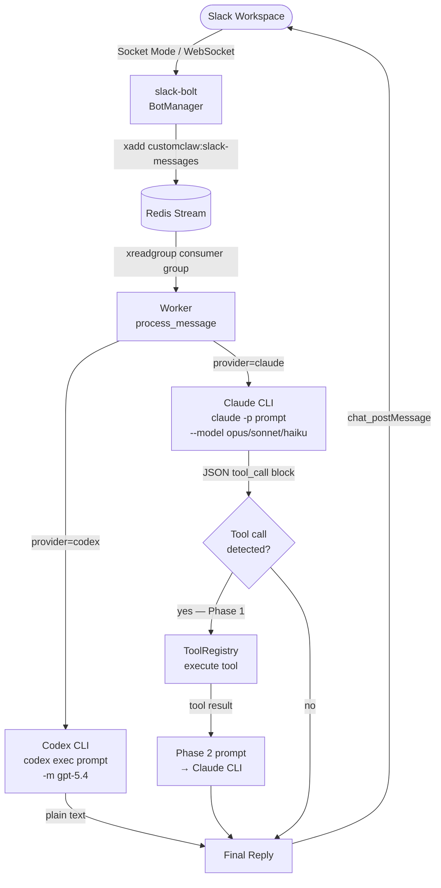

### 2.2 Worker ↔ Data Stores

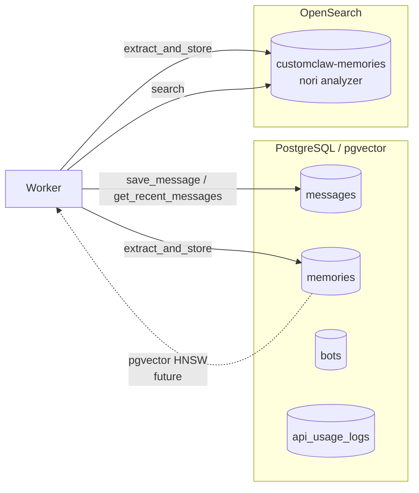

### 2.3 Git Worker (Redis Stream)

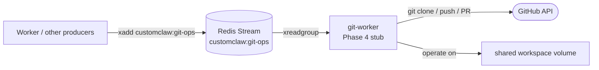

> **Note:** git-worker is currently a stub pending Phase 4 implementation. The Redis stream infrastructure is in place.

### 2.4 Airflow DAG Processing

```mermaid
flowchart TD
    GHA([GitHub Actions\nwebhook]) -->|SSH trigger| AF[Airflow Scheduler]
    GHA2([GitHub Actions\nissue-comment-reeval.yml]) -->|re-trigger on needs-input reply| AF

    subgraph DAG1 [omc_issue_analyzer — 4-Phase Pipeline]
        T1[fetch_issue_details] --> T2[determine_analysis_depth]
        T3[sync_repo] --> T2

        %% Phase 1: parallel analysis
        T2 --> T4[analyze_architect\nClaude CLI opus]
        T2 --> T5[analyze_colleague\nClaude CLI opus]

        %% Phase 2: Professor synthesis
        T4 --> T6[professor_synthesize\ncombines both analyses]
        T5 --> T6

        %% Phase 3: Professor decision
        T6 --> T7[professor_decide\nauto-dev or needs-input]

        %% Phase 4: omcustom-driver auto-development
        T7 -->|auto-dev approved| T8[omcustom_driver\nbranch → implement → PR]
        T7 -->|needs-input| T9[post_needs_input_comment\nGitHub comment + label]
    end

    subgraph DAG2 [claude_code_release_monitor]
        R1[fetch_releases\nGitHub API] --> R2[filter_new_releases]
        R2 --> R3[create_issues\nGitHub API]
        R3 --> R4[analyze_issues\nClaude CLI]
    end

    GHA3([GitHub Actions\nPR webhook]) -->|SSH trigger| AF

    subgraph DAG3 [gpt_codex_release_monitor]
        G1[fetch_releases\nopenai/codex] --> G2[filter_new_releases]
        G2 --> G3[create_issues\nGitHub API]
        G3 --> G4[analyze_issues\nClaude CLI]
        G2 --> G5[update_codex]
    end

    subgraph DAG4 [omc_codebase_indexer]
        X1[scan_files] --> X2[index_codebase\nOpenSearch]
    end

    subgraph DAG5 [omc_feedback_collector]
        F1[validate_feedback] --> F2[create_github_issue]
    end

    subgraph DAG6 [omc_pr_analyzer]
        P1[fetch_pr_details] --> P2[determine_analysis_scope]
        P2 --> P3[request_worker_analysis\nRedis Stream]
    end

    AF --> DAG1
    AF --> DAG2
    AF --> DAG3
    AF --> DAG4
    AF --> DAG5
    AF --> DAG6

    DAG1 -->|reads| OMCR[owner/your-repo\nlocal clone]
    DAG2 -->|watches| CCR[anthropics/claude-code\nreleases API]
```

### 2.5 Web UI

```mermaid
flowchart TD
    Browser([Browser]) -->|HTTPS via Cloudflare Tunnel| WUI[Next.js 16\nweb-ui :3000]

    WUI -->|NextAuth GitHub OAuth| GHO([GitHub OAuth])
    WUI -->|Prisma ORM| PG[(PostgreSQL)]
    WUI -->|Bearer token proxy| AFAPI[Airflow REST API v2\n:8080]
    WUI -->|TCP health check| RD[(Redis :6379)]
    WUI -->|HTTP health check| OS2[OpenSearch :9200]

    subgraph API Routes
        AR1[/api/bots\nCRUD]
        AR2[/api/airflow/dags\nDAG list + runs]
        AR3[/api/messages\nconversation history]
        AR4[/api/usage\ntoken usage]
        AR5[/api/health\nservice health]
    end

    WUI --> AR1
    WUI --> AR2
    WUI --> AR3
    WUI --> AR4
    WUI --> AR5
```

### 2.6 Full Service Topology

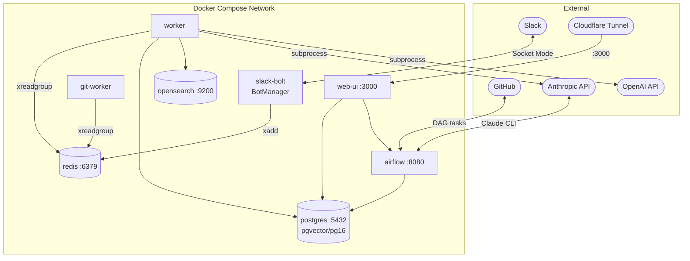

---

## 3. Component Details

### 3.1 slack-bolt (`app.py` / `bot_runner.py`)

`BotManager` is the entry point. On startup it:

1. Calls `load_all_bots(bots_dir)` to read all `*.yaml` files from `/app/bots/`.
2. Instantiates one `BotRunner` per config, each holding its own `slack_bolt.App` and `WebClient`.
3. Starts each `SocketModeHandler` in a dedicated daemon thread.

`BotRunner` registers a single `message` event handler. For each eligible message it:

- Filters by `allowed_channels` and `allowed_users` from `SecurityConfig`.
- Adds an `hourglass_flowing_sand` emoji reaction to the source message.
- Publishes the event (bot_id, channel_id, thread_ts, user_id, text, message_ts, bot_token) to Redis Stream key `customclaw:slack-messages` via `xadd`.

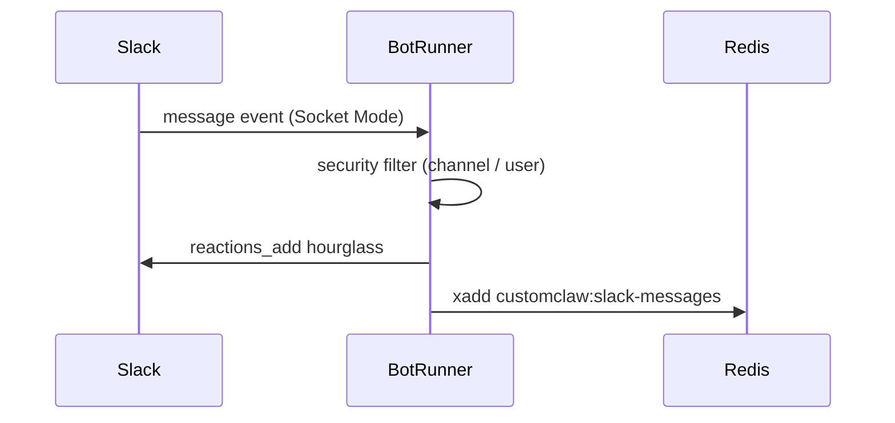

### 3.2 Worker (`worker.py`)

The worker is the core processing engine. It joins Redis consumer group `customclaw-workers` under a consumer name derived from its hostname (allowing horizontal scaling).

**Processing modes:**

| Mode | Trigger | Execution |
|------|---------|-----------|
| `full_agent` | `claude.full_agent: true` | Single Claude/Codex CLI call; CLI has native file/shell tools |
| Limited (tool-call) | `claude.full_agent: false` | Two-phase: Phase 1 detects tool intent, Phase 2 synthesizes result |

**Two-phase tool-call protocol:**

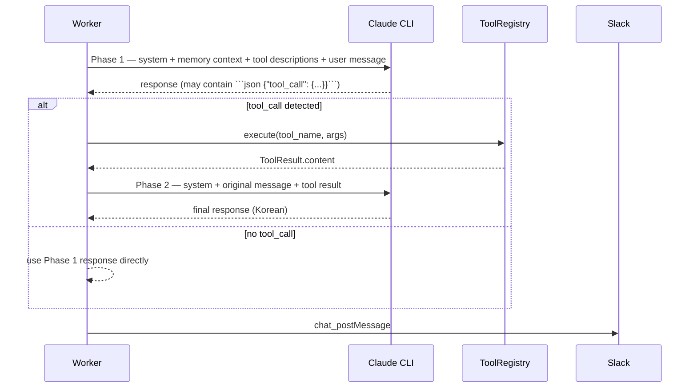

**Supported providers:**

- `claude` — invokes `claude -p <prompt_file> --model <model> --max-turns <n>` (optionally with `--dangerously-skip-permissions` for full-agent mode)
- `codex` — invokes `codex exec <prompt> -m gpt-5.4 --dangerously-bypass-approvals-and-sandbox`

**Prompt construction** (`_build_system_prompt`): concatenates persona personality, GitHub repo reference, and local repo path from `BotConfig`.

**Memory context**: before each Phase 1 call, `HybridSearch.search(bot_id, text, top_k=5)` retrieves relevant memories from OpenSearch and prepends them to the prompt as `## 기억하고 있는 관련 정보:`.

**Post-processing**: after sending the reply, `MemoryExtractor.extract_and_store` is called asynchronously (best-effort, non-blocking) to mine facts, decisions, and preferences from the conversation.

### 3.3 Git Worker (`git_worker.py`)

Currently a Phase 4 stub for general async git operations. The worker subscribes to a Redis Stream for git operation events. Full implementation will handle `git clone`, `git push`, branch management, and PR creation via GitHub API, operating on the `repos` shared volume.

> **Note:** The `worker` container image now includes `git` and the `gh` CLI, which are required by the `omcustom-driver` auto-development pipeline (see section 3.9).

### 3.4 Memory System

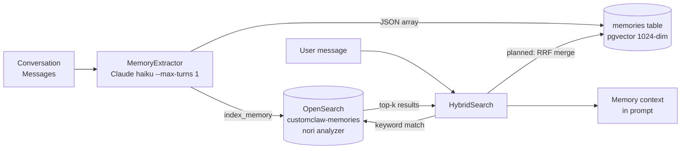

**Extraction pipeline:**

1. `MemoryExtractor` takes the last 10 messages (each capped at 500 chars).
2. Sends to `claude --model haiku --max-turns 1` with a structured extraction prompt.
3. Parses the returned JSON array of `{category, content}` items.
4. Stores each in PostgreSQL `memories` table (with a zero-vector placeholder pending Voyage API integration) and indexes in OpenSearch.

**Search pipeline:**

- `HybridSearch` queries OpenSearch using the `korean` nori analyzer for morphological tokenization of Korean text.
- pgvector semantic search (HNSW index) is planned for future activation with the Voyage API embedding model (`voyage-3` / 1024 dimensions).
- Final merge via RRF (Reciprocal Rank Fusion) is designed but not yet active.

**Memory categories:** `fact`, `decision`, `preference`

### 3.5 Tool System

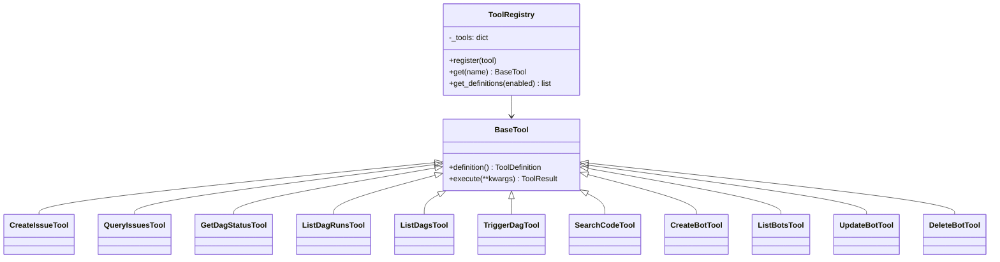

Tools are passed to Claude via formatted prompt text (not native Anthropic tool-use API). Claude outputs a ````json {"tool_call": {"name": ..., "arguments": {...}}}` block which the worker parses with `_extract_tool_call`. Tool categories:

| Category | Tools |
|----------|-------|
| GitHub | `create_issue`, `query_issues` |
| Airflow | `get_dag_status`, `list_dag_runs`, `list_dags`, `trigger_dag` |
| Code | `search_code` (invokes Claude CLI on the local repo) |
| Bot Management | `create_bot`, `list_bots`, `update_bot`, `delete_bot` |

Per-bot tool access is controlled by `tools.enabled` in the bot YAML config.

### 3.6 Bot Configuration (`config/loader.py`)

Bot configurations are loaded from YAML files in `/app/bots/`. Each file maps to a `BotConfig` dataclass with the following sections:

| Section | Key Fields |
|---------|-----------|
| `slack` | `app_token` (Socket Mode), `bot_token` (Web API) |
| `persona` | `display_name`, `personality` (injected into system prompt) |
| `project` | `repo_path`, `github_repo`, `github_token_var` |
| `claude` | `provider` (claude/codex), `model`, `max_turns`, `full_agent` |
| `memory` | `context_window`, `auto_extract` |
| `security` | `allowed_channels`, `allowed_users`, `dangerous_tools` |
| `tools` | `enabled` (list of allowed tool names) |

Environment variable references in the form `${VAR_NAME}` are resolved at load time.

### 3.7 Web UI (`web-ui/`)

Built with Next.js 16 (App Router), TypeScript, and Prisma ORM.

**Authentication:** NextAuth.js with `PrismaAdapter` and GitHub OAuth provider. All API routes check session via `auth()`.

**Airflow proxy:** `airflowFetch()` acquires a short-lived Bearer token from `/auth/token` before each request to the Airflow REST API v2 (`http://airflow:8080/api/v2`), avoiding credential exposure to the browser.

**API routes:**

| Route | Method | Purpose |
|-------|--------|---------|
| `/api/bots` | GET, POST | List / create bots (PostgreSQL) |
| `/api/bots/[id]` | GET, PUT, DELETE | Bot CRUD |
| `/api/airflow/dags` | GET | List DAGs via Airflow proxy |
| `/api/airflow/dags/[dagId]/runs` | GET, POST | List / trigger DAG runs |
| `/api/airflow/import-errors` | GET | DAG import errors |
| `/api/messages` | GET | Conversation history |
| `/api/usage` | GET | API token usage summary |
| `/api/health` | GET | Service health (PostgreSQL, Redis, OpenSearch, Airflow) |

### 3.8 Airflow DAGs

**`omc_issue_analyzer`** — 4-Phase Analysis Pipeline

Triggered via GitHub Actions webhook (SSH) when a new issue is opened, or re-triggered by `issue-comment-reeval.yml` when a user replies to a `needs-input` issue.

| Phase | Tasks | Description |
|-------|-------|-------------|
| Phase 1 | `analyze_architect` + `analyze_colleague` | Parallel Claude opus analyses — senior architect perspective and peer colleague perspective |
| Phase 2 | `professor_synthesize` | Professor agent combines both Phase 1 analyses into a unified synthesis |
| Phase 3 | `professor_decide` | Professor makes a routing decision: `auto-dev` (approve automated development) or `needs-input` (request more information) |
| Phase 4 | `omcustom_driver` | Professor-gated: only runs on `auto-dev` approval. Creates branch, implements changes, commits, pushes, and opens a PR. Posts real-time progress as GitHub issue comments. |

Max-turns is label-driven (`epic`/`architecture` → 50, `bug`/`enhancement` → 50, `documentation`/`chore` → 50 — upgraded to opus with higher turn limits).

**`claude_code_release_monitor`**

Scheduled DAG that polls `anthropics/claude-code` GitHub releases. Filters for releases not yet tracked, creates GitHub issues on `owner/your-repo`, and runs Claude CLI analysis on the release notes to detect breaking changes.

**`gpt_codex_release_monitor`**

Scheduled DAG that polls `openai/codex` GitHub releases. Creates tracking issues on `owner/your-repo` and auto-updates the Codex CLI in the worker container when new releases are detected.

| Phase | Tasks | Description |
|-------|-------|-------------|
| Fetch | `fetch_releases` | Polls openai/codex GitHub releases API |
| Filter | `filter_new_releases` | Filters releases not yet tracked |
| Track | `create_issues` + `analyze_issues` | Creates GitHub issues and analyzes release notes |
| Update | `update_codex` | Auto-updates Codex CLI binary in worker container |

**`omc_codebase_indexer`**

Scheduled DAG that indexes the oh-my-customcode codebase into OpenSearch for RAG-based full-text code search.

| Phase | Tasks | Description |
|-------|-------|-------------|
| Scan | `scan_files` | Scans repository for indexable files (`.ts`, `.py`, `.md`, `.yaml`, `.yml`, `.json`) |
| Index | `index_codebase` | Indexes file contents into OpenSearch with nori analyzer |

**`omc_feedback_collector`**

Triggered via Airflow REST API or CLI. Receives user feedback submitted through the `/omcustom:feedback` skill, validates input, and creates a labeled GitHub issue on `owner/your-repo`. Supports anonymous submissions.

| Phase | Tasks | Description |
|-------|-------|-------------|
| Validate | `validate_feedback` | Validates title, body, and feedback type (`bug`/`feature`/`improvement`/`question`/`general`) |
| Create | `create_github_issue` | Creates GitHub issue with appropriate labels and formatting |

**`omc_pr_analyzer`**

Triggered via GitHub Actions webhook (SSH) when a PR is opened, synchronized, or marked ready for review. Fetches PR details, determines analysis scope based on PR size, and publishes an analysis request to Redis Stream. Uses Redis distributed locking (`SET NX EX`, 15-minute TTL) to prevent duplicate analysis of the same PR.

| Phase | Tasks | Description |
|-------|-------|-------------|
| Fetch | `fetch_pr_details` | Retrieves PR metadata, files changed, and diff from GitHub API |
| Scope | `determine_analysis_scope` | Classifies PR as small/medium/large and sets max analysis turns |
| Publish | `request_worker_analysis` | Acquires Redis dedup lock; publishes to `customclaw:analysis-requests` stream |

### 3.9 omcustom-driver (Auto-Development Agent)

The `omcustom-driver` is an autonomous development agent that activates only when the Professor approves a GitHub issue for automated development.

**Lifecycle:**

1. **Professor gate**: Activated only when `professor_decide` outputs `auto-dev`
2. **Progress reporting**: Posts real-time status as GitHub issue comments throughout execution
3. **Follow-up questions**: If additional context is needed, attaches `needs-input` label and posts a question as an issue comment; waits for user reply before continuing
4. **Auto-development**: Creates a feature branch → implements changes → commits → pushes → opens a pull request
5. **Re-evaluation loop**: `issue-comment-reeval.yml` in the `oh-my-customcode` repository re-triggers the full analysis pipeline whenever a user responds to a `needs-input` issue

**GitHub labels:**

| Label | Meaning |
|-------|---------|
| `auto-dev` | Professor approved automated development — omcustom-driver activates |
| `needs-input` | More information required — awaiting user response |

**Analysis consumer reliability:**

The analysis consumer uses `xautoclaim` recovery to reclaim unacknowledged messages after a configurable idle timeout, preventing message loss when the consumer restarts.

### 3.10 Analysis Worker (`analysis_worker.py`)

A dedicated Redis Stream consumer that processes PR analysis and issue analysis requests independently from the main message worker.

**Architecture:**
- **Stream**: `customclaw:analysis-requests` / Consumer Group: `analysis-workers`
- **Consumer**: Named `analyzer-{hostname}` for horizontal scaling
- **Thread pool**: `ThreadPoolExecutor` with configurable `MAX_ANALYSIS_WORKERS` (default: 5)

**PR Analysis workflow:**
1. Consumes analysis request from Redis Stream
2. Posts "analysis started" Slack notification (captures `thread_ts` for threading)
3. Invokes Claude CLI for architect + colleague parallel analyses
4. Posts intermediate progress as thread reply
5. Synthesizes results via Professor analysis
6. Posts final summary as thread reply with checkmark reaction on start message

**Reliability features:**
- `xautoclaim` recovery for unacknowledged messages after configurable idle timeout (`ANALYSIS_PENDING_IDLE_MS`)
- Redis distributed lock (`SET NX EX`, 15-min TTL) prevents duplicate analysis of same PR
- Slack message threading keeps analysis updates organized per PR

### 3.11 Process Management (`supervisor.py` / `runtime_control.py`)

`supervisor.py` is a process supervisor that manages worker/app restarts. `runtime_control.py` provides Redis-based helpers for safe self-restart requests.

**Supervisor lifecycle:**
1. Launches the target process (worker or app) as a subprocess
2. Monitors for exit code `75` (restart requested)
3. On exit code 75: restarts the process with the same arguments
4. On other exit codes: propagates the exit

**Runtime control:**
- Restart requests communicated via Redis key `customclaw:control:restart`
- `CUSTOMCLAW_SUPERVISED` environment variable indicates supervised mode
- `CUSTOMCLAW_RUNTIME_TARGET` specifies which module to supervise

### 3.12 GitHub Actions Workflows (`workflows/`)

| Workflow | File | Trigger | Description |
|----------|------|---------|-------------|
| PR Analysis | `workflows/pr-analysis.yml` | `pull_request: [opened, synchronize, ready_for_review]` | SSHes to production server, triggers `omc_pr_analyzer` DAG with PR number. Skips draft PRs. |
| Feedback Submission | `workflows/feedback-submission.yml` | `workflow_dispatch` (manual) | Accepts title, body, feedback_type, anonymous flag. SSHes to server, triggers `omc_feedback_collector` DAG. |

Both workflows use SSH with deploy keys to reach the production server and trigger Airflow DAGs via `docker exec`.

---

## 4. Data Flow — User Message End-to-End

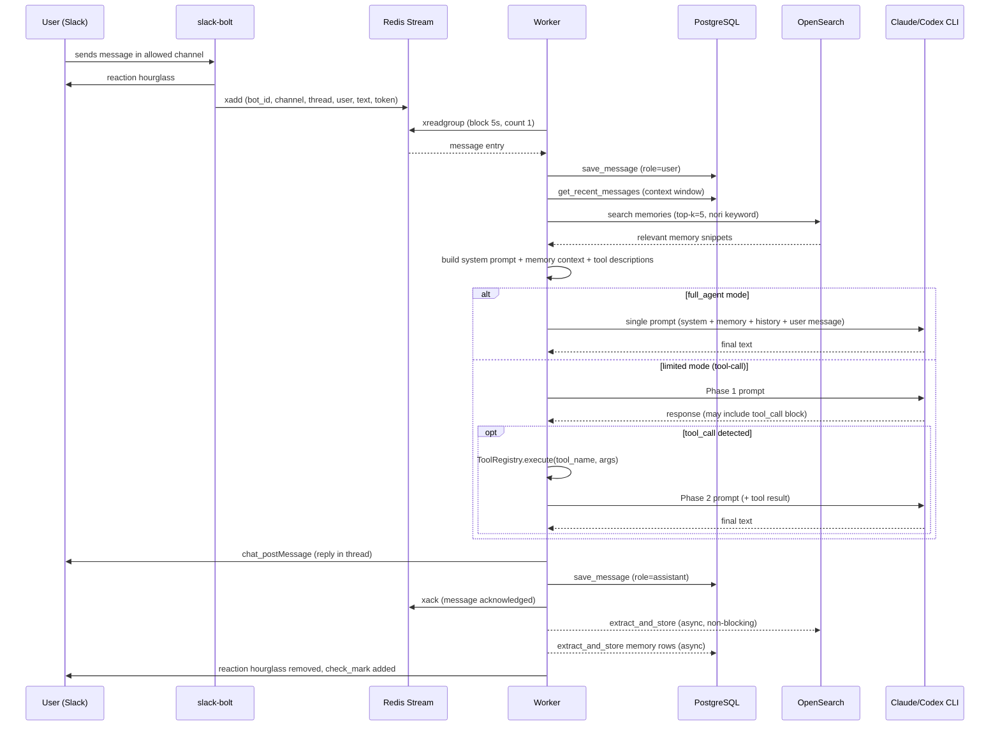

**Step-by-step summary:**

1. User sends a message to Slack. `BotRunner` validates channel/user, adds hourglass reaction, and publishes to Redis Stream.
2. Worker picks up the message via `xreadgroup` from consumer group `customclaw-workers`.
3. User message saved to `messages` table. Recent thread/channel history loaded for context window.
4. OpenSearch queried for relevant long-term memories using Korean keyword search.
5. Prompt assembled from: persona, memory context, conversation history, tool descriptions (limited mode) or bare user message (full-agent mode).
6. Claude CLI or Codex CLI invoked as subprocess. In limited mode a second call may follow if a tool was used.
7. Final text posted to Slack. Assistant message saved to PostgreSQL. Redis Stream entry acknowledged.
8. Asynchronously (non-blocking): `MemoryExtractor` runs Claude haiku to mine facts/decisions/preferences from the conversation; results stored in PostgreSQL + OpenSearch.

---

## 5. Database Schema

### 5.1 `messages`

Stores all Slack messages (user + assistant roles) for conversation context retrieval.

| Column | Type | Notes |
|--------|------|-------|
| `id` | UUID PK | `gen_random_uuid()` |
| `bot_id` | VARCHAR(64) | References logical bot |
| `channel_id` | VARCHAR(64) | Slack channel |
| `thread_ts` | VARCHAR(64) | Thread root timestamp |
| `user_id` | VARCHAR(64) | Slack user or `"system"` for assistant |
| `role` | VARCHAR(16) | `user` or `assistant` |
| `content` | TEXT | Message body |
| `timestamp` | TIMESTAMPTZ | Default NOW() |
| `embedding` | vector(1024) | HNSW index (cosine); future semantic search |
| `metadata` | JSONB | Reserved |

Index: `(bot_id, channel_id, thread_ts)` for fast context retrieval; HNSW on embedding.

### 5.2 `memories`

Long-term extracted memories per bot, with pgvector embeddings for future semantic retrieval.

| Column | Type | Notes |
|--------|------|-------|
| `id` | UUID PK | Synced with OpenSearch `_id` |
| `bot_id` | VARCHAR(64) | Bot scope |
| `user_id` | VARCHAR(64) | Optional user scope |
| `category` | VARCHAR(32) | `fact`, `decision`, `preference` |
| `content` | TEXT | Extracted memory text |
| `source_message_id` | UUID FK → messages | Provenance |
| `embedding` | vector(1024) | HNSW index; zero-vector until Voyage API |
| `created_at` | TIMESTAMPTZ | — |
| `expires_at` | TIMESTAMPTZ | Optional TTL |
| `metadata` | JSONB | Reserved |

### 5.3 `bots`

Bot configuration store (managed via Web UI; YAML files are the bootstrap source).

| Column | Type | Notes |
|--------|------|-------|
| `id` | VARCHAR(64) PK | Bot identifier |
| `name` | VARCHAR(128) | Display name |
| `slack_app_token` | TEXT | Encrypted at application layer |
| `slack_bot_token` | TEXT | Encrypted at application layer |
| `channels` | JSONB | `[]` of Slack channel IDs |
| `persona` | JSONB | Personality and display config |
| `project` | JSONB | Repo path, GitHub repo, token var |
| `airflow` | JSONB | DAG prefix |
| `tools` | JSONB | Enabled tool list |
| `claude` | JSONB | Provider, model, max_turns, full_agent |
| `memory` | JSONB | Context window, auto_extract |
| `security` | JSONB | Allowed channels/users, dangerous tools |
| `is_active` | BOOLEAN | Soft-delete flag |
| `created_at` / `updated_at` | TIMESTAMPTZ | Audit timestamps |

### 5.4 `api_usage_logs`

Token usage tracking per bot invocation.

| Column | Type | Notes |
|--------|------|-------|
| `id` | UUID PK | — |
| `bot_id` | VARCHAR(64) | — |
| `user_id` | VARCHAR(64) | — |
| `model` | VARCHAR(64) | e.g., `claude-opus-4-5` |
| `input_tokens` / `output_tokens` | INTEGER | — |
| `cost_usd` | NUMERIC(10,6) | — |
| `tool_name` | VARCHAR(64) | If tool was invoked |
| `created_at` | TIMESTAMPTZ | Index: `(bot_id, created_at)` |

### 5.5 Entity Relationships

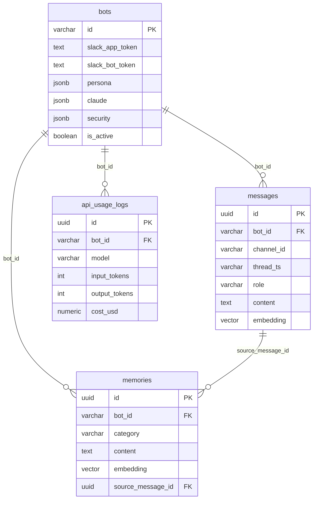

---

## 6. Infrastructure

### 6.1 Docker Compose Service Map

| Service | Image / Dockerfile | Ports | Volumes | Purpose |
|---------|-------------------|-------|---------|---------|
| `postgres` | `pgvector/pgvector:pg16` | 5432 | `pgdata`, `migrations/` | Primary datastore |
| `opensearch` | `docker/opensearch/Dockerfile` | — | `osdata` | Korean keyword search |
| `redis` | `redis:7-alpine` | — | `redisdata` | Message queue (AOF) |
| `airflow` | `docker/airflow/Dockerfile` | 8080 | `dags/`, `repos` | DAG scheduler + webserver |
| `slack-bolt` | `docker/slack-bolt/Dockerfile` | — | `bots/`, `repos` | Socket Mode event ingestion |
| `worker` | `docker/slack-bolt/Dockerfile` | — | `bots/`, `repos`, Claude/Codex auth | AI response processing |
| `git-worker` | `docker/slack-bolt/Dockerfile` | — | `repos` | Git operations (Phase 4 stub) |
| `web-ui` | `docker/web-ui/Dockerfile` | 3000 | — | Management web interface |

### 6.2 Named Volumes

| Volume | Used By | Contents |
|--------|---------|----------|
| `pgdata` | postgres | PostgreSQL data files |
| `osdata` | opensearch | OpenSearch index data |
| `redisdata` | redis | Redis AOF persistence |
| `repos` | airflow, slack-bolt, worker, git-worker | Cloned git repositories (shared) |

### 6.3 Host Bind Mounts (Worker)

| Host Path | Container Path | Purpose |
|-----------|---------------|---------|
| `${CLAUDE_CONFIG_DIR}` | `${CLAUDE_CONFIG_DIR}` | Claude CLI config and auth |
| `${CLAUDE_CREDENTIALS_FILE}` | `${CLAUDE_CREDENTIALS_FILE}` | Claude CLI credentials |
| `${CLAUDE_CLI_BINARY}` | `/usr/local/bin/claude` (ro) | Claude CLI binary |
| `${CODEX_CONFIG_DIR}` | `${CODEX_CONFIG_DIR}` | Codex CLI config and auth |

### 6.4 Networking

All services share the default Docker Compose bridge network. Inter-service communication uses Docker DNS names:
- `postgres:5432`, `redis:6379`, `opensearch:9200`, `airflow:8080`

OpenSearch security plugin is disabled (`plugins.security.disabled=true`) for internal-only deployment.

### 6.5 Health Checks

| Service | Check | Interval | Retries |
|---------|-------|----------|---------|
| postgres | `pg_isready` | 10s | 5 |
| opensearch | `/_cluster/health?wait_for_status=yellow` | 10s | 10 (60s start delay) |
| redis | `redis-cli ping` | 10s | 5 |

`worker` and `web-ui` wait for `postgres` and `redis` health conditions before starting. `worker` additionally waits for `opensearch`.

### 6.6 Key Environment Variables

Selected environment variables required across services:

| Variable | Service | Description |
|----------|---------|-------------|
| `OPENSEARCH_ADMIN_PASSWORD` | opensearch | Initial admin password for OpenSearch |
| `ENCRYPTION_KEY` | slack-bolt, worker | Application-level bot token encryption key |
| `DATABASE_URL` | worker, web-ui | PostgreSQL connection string |
| `REDIS_URL` | worker, slack-bolt | Redis connection string |

---

## 7. Deployment Architecture

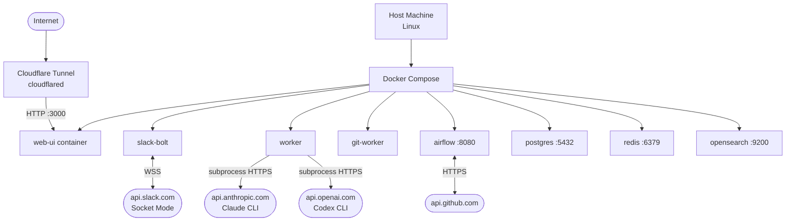

### 7.1 Port Exposure

| Service | Host Port | Access |
|---------|-----------|--------|
| postgres | 5432 | Local development only |
| airflow | 8080 | Local / internal |
| web-ui | 3000 | Via Cloudflare Tunnel (public) |
| redis / opensearch | — | Not exposed to host |

### 7.2 External Connectivity

- **Slack:** `slack-bolt` maintains a persistent outbound WebSocket connection to `api.slack.com` using Socket Mode — no inbound port required.
- **GitHub:** Airflow DAGs communicate with `api.github.com` outbound; `omc_issue_analyzer` is triggered inbound via GitHub Actions → SSH → `airflow dags trigger`.
- **Anthropic / OpenAI:** `worker` and Airflow DAGs call Claude CLI and Codex CLI as subprocesses; CLIs communicate with the respective APIs over HTTPS.
- **Web UI:** Exposed publicly via Cloudflare Tunnel on port 3000 with TLS termination at Cloudflare.

### 7.3 Secrets Management

Secrets are supplied via `.env` file loaded by Docker Compose. Bot YAML configs reference environment variables using `${VAR_NAME}` syntax resolved at runtime by `config/loader.py`. The `ENCRYPTION_KEY` environment variable is available to `slack-bolt` and `worker` for application-level token encryption.
