# CustomClaw 아키텍처 문서

> [English](architecture.en.md)

## 1. 시스템 개요

CustomClaw는 멀티플랫폼 멀티봇 AI 플랫폼으로, 여러 봇을 하나의 인프라에서 운영하면서 각 봇이 독립적인 퍼소나·프로젝트 컨텍스트·도구 세트를 가질 수 있도록 설계되어 있습니다. Discord, Mattermost 플랫폼 어댑터를 기본 지원하며, Slack 어댑터는 선택적(optional) 의존성입니다. 플랫폼 어댑터는 `PlatformRegistry` 패턴으로 런타임에 등록되어 플랫폼별 하드코딩 없이 어댑터/퍼블리셔를 생성합니다. 사용자 메시지는 플랫폼별 어댑터를 통해 수신되고, Redis Stream(`customclaw:platform-messages`)을 거쳐 Worker로 비동기 전달됩니다. **Primary Worker는 Go**(`go/cmd/worker/main.go`)로 마이그레이션 완료되었으며, Python worker는 deprecated 상태입니다. Worker는 Claude CLI(Anthropic) 또는 Codex CLI(OpenAI)를 subprocess로 호출해 응답을 생성하며, 대화 이력은 PostgreSQL에, 장기 기억은 PostgreSQL(pgvector 임베딩) + OpenSearch(한국어 nori 키워드 검색)의 하이브리드 구조로 저장됩니다. Docker 이미지는 AWS ECR(`849376369259.dkr.ecr.ap-northeast-2.amazonaws.com`)에서 관리됩니다. Airflow는 GitHub 이슈 분석·릴리즈 모니터링·공식 문서 변경 감지 등 자동화 DAG 9개를 담당하고, Next.js 기반 Web UI가 봇 관리와 모니터링 기능을 제공합니다.

---

## 2. 아키텍처 다이어그램

### 2.1 전체 시스템 아키텍처

<p align="center"></p>

### 2.2 메시지 처리 흐름 (Sequence)

<p align="center">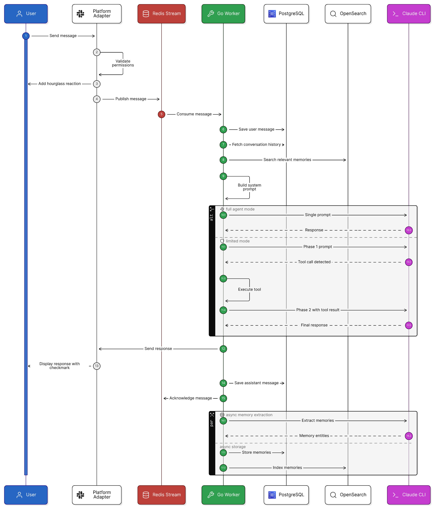</p>

---

## 3. 컴포넌트 상세

### 3.1 플랫폼 어댑터 (app.py / bot_runner.py)

`BotManager`는 `/app/bots/*.yaml` 파일을 로드하고, `PlatformRegistry`를 통해 플랫폼별 어댑터를 초기화합니다. 각 플랫폼 어댑터 모듈은 import 시점에 `PlatformRegistry.register()`로 자기 자신을 등록하므로, 플랫폼 추가/제거 시 중앙 코드 변경이 필요 없습니다.

**Slack 어댑터** (optional): `slack-bolt`(platform-adapter 서비스)은 선택적 의존성으로, `platforms/__init__.py`에서 `try/except ImportError`로 import됩니다. `_build_slack_adapters()`도 `try/except`로 감싸여 Slack 라이브러리 없이도 시스템이 정상 동작합니다. 각 봇에 대해 `BotRunner` 인스턴스를 생성한 뒤 별도 스레드에서 Slack Socket Mode Handler를 시작합니다.
- `message` 이벤트를 수신하고 `subtype`이 있는 메시지(봇 메시지, 수정 이벤트 등)는 무시합니다.
- `security.allowed_channels` / `security.allowed_users` 필터를 적용합니다.
- 검증을 통과한 메시지를 `customclaw:platform-messages` Redis Stream에 `xadd`합니다.
- 처리 중 ⏳ 리액션을 추가해 사용자에게 진행 상황을 알립니다.

**Discord 어댑터** (`platforms/discord_adapter.py`): `discord.py` 라이브러리 기반. `DiscordConfig`의 `token`으로 연결하고, `guild_id`로 서버를 제한합니다. `security.mention_only: true` 설정 시 봇 멘션이 포함된 메시지만 처리합니다.

**Mattermost 어댑터**: Mattermost WebSocket API 기반 어댑터.

<p align="center">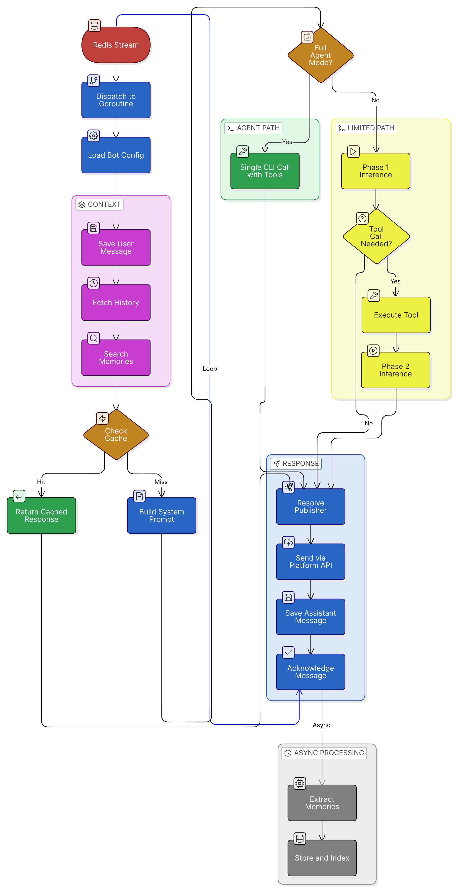</p>

### 3.2 Worker

**Primary Worker는 Go** (`go/cmd/worker/main.go`)로 마이그레이션 완료되었습니다. Python worker (`bot_engine/worker.py`)는 deprecated이며 `profiles: [legacy]`로 프로파일 아웃되어 있습니다.

Go worker는 Redis Consumer Group(`customclaw-workers`) 방식으로 `customclaw:platform-messages` 스트림을 소비합니다. `docker-compose.go-shadow.yml`로 실행되며, 여러 Worker 인스턴스를 병렬 실행하면 자동으로 부하가 분산됩니다.

`_get_publisher()`(Python) / `PublisherFactory`(Go)는 `PlatformRegistry` 패턴을 사용하여 플랫폼별 퍼블리셔를 생성합니다. 등록되지 않은 플랫폼에는 `NoOpResponsePublisher`를 반환하여 안전하게 폴백합니다.

**2-Phase Prompt 방식 (limited mode):**
1. **Phase 1**: 시스템 프롬프트 + 기억 컨텍스트 + 도구 설명 + 대화 이력 + 사용자 메시지를 전달. Claude는 `json tool_call` 블록을 포함할 수 있습니다.
2. **Phase 2**: tool_call 감지 시 해당 도구를 실행하고, 원본 메시지 + 도구 결과를 Claude에 다시 전달해 최종 응답을 생성합니다.

**full_agent mode**: Claude CLI에 `--dangerously-skip-permissions`를 적용하고 Claude 자체의 내장 도구(파일 조작, Bash 등)를 모두 활성화합니다. tool_call JSON 파싱 없이 단일 프롬프트로 동작합니다.

**Codex provider**: `codex exec --dangerously-bypass-approvals-and-sandbox`로 실행. 응답 메타데이터 헤더/푸터를 파싱해 순수 콘텐츠만 추출합니다.

| 설정 | 설명 |
|------|------|
| `claude.provider` | `claude` (기본) 또는 `codex` |
| `claude.model` | `opus` / `sonnet` / `haiku` (또는 `gpt-5.4`) |
| `claude.max_turns` | CLI 최대 턴 수 (기본 10) |
| `claude.full_agent` | full_agent 모드 활성화 |
| `memory.context_window` | 대화 이력 불러올 메시지 수 (기본 20) |

### 3.3 메모리 시스템

<p align="center">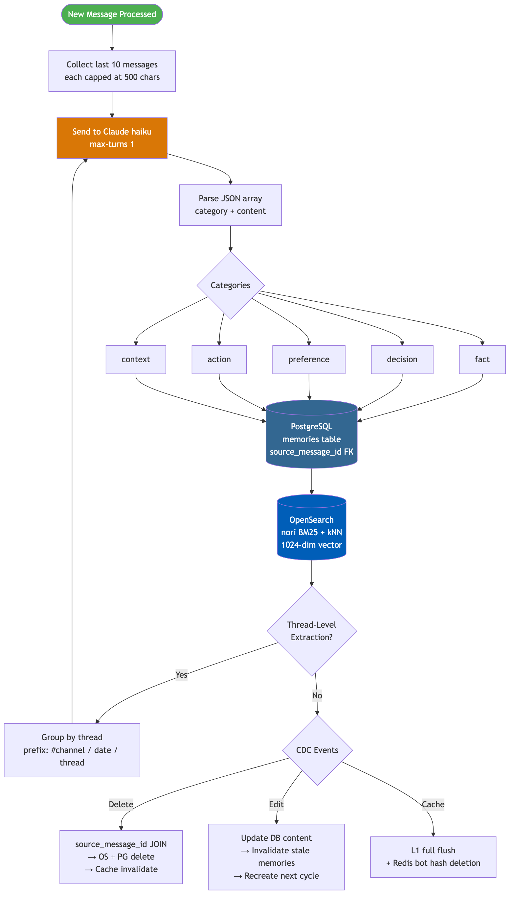</p>

**추출 파이프라인:**

1. `MemoryExtractor`가 최근 10개 메시지를 수집 (각 500자 제한).
2. Claude haiku(`--max-turns 1`)에 구조화된 추출 프롬프트 전달.
3. `{category, content}` JSON 배열 파싱.
4. PostgreSQL `memories` 테이블에 `source_message_id`로 원본 메시지 연결 후 저장, OpenSearch에 임베딩 벡터와 함께 인덱싱.
5. 채널 레벨 추출 후 스레드 레벨 추출 실행 — 컨텍스트 프리픽스 (`[#채널 | 날짜 | thread]`) 포함.

**검색 파이프라인:**

- `HybridSearch`가 BM25 키워드 검색 (nori 한국어 분석기) + kNN 벡터 유사도 검색을 결합.
- 멀티 티어 캐시: L1 정확 매칭 (인메모리, 5분 TTL) → L2 시맨틱 (Redis 코사인 유사도 ≥ 0.95, 15분 TTL) → L3 KV 프리픽스 캐시 (Anthropic API) → L4 풀 추론.
- 단축 액션 쿼리 ("해줘", "계속해" 등)는 PostgreSQL 우선 경로로 라우팅.
- 쿼리 확장: 한국어 동사 어미 제거 + 복수 쿼리 변형 병렬 검색.

**CDC (Change Data Capture) 파이프라인:**

- **메시지 삭제**: `DeleteByPlatformMsgID`가 `source_message_id` JOIN으로 연관 메모리 추적 → OpenSearch + PostgreSQL에서 삭제 → 검색 캐시 무효화.
- **메시지 수정**: 수정된 메시지와 연결된 stale 메모리 무효화. 다음 추출 사이클에서 수정된 내용으로 메모리 재생성.
- 캐시 무효화: 삭제/수정 이벤트 시 L1 전체 플러시 + Redis 봇 해시 삭제.

**메모리 카테고리:** `fact`, `decision`, `preference`, `action`, `context`

### 3.4 도구 시스템 (tools/)

<p align="center">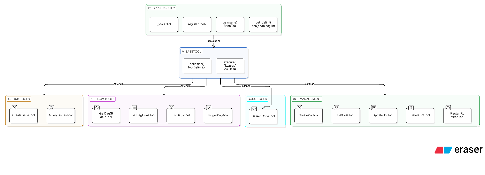</p>

| 카테고리 | 도구 | 설명 |
|----------|------|------|
| GitHub | `create_issue`, `query_issues` | 이슈 생성·조회 (봇 설정의 `github_repo` + `github_token_var` 사용) |
| Airflow | `get_dag_status`, `list_dag_runs`, `list_dags`, `trigger_dag` | DAG 상태 조회·트리거 |
| 코드 검색 | `search_code` | 로컬 리포지토리 Claude CLI 검색 (`repo_path` 기반) |
| 봇 관리 | `create_bot`, `list_bots`, `update_bot`, `delete_bot` | 런타임 봇 CRUD |
| 런타임 제어 | `restart_runtime` | worker / app / all 안전 재시작 요청 (`target`: worker\|app\|all) |

총 12개 도구. 봇별 `tools.enabled` 설정으로 허용할 도구 집합을 제한할 수 있습니다.

### 3.5 봇 설정 (config/loader.py)

봇 설정은 YAML 파일(`/app/bots/*.yaml`) 또는 PostgreSQL `bots` 테이블에서 로드됩니다. 환경 변수 레퍼런스(`${ENV_VAR}` 형식)는 자동으로 확장됩니다. `platform` 필드로 `slack` / `mattermost` / `discord` 중 하나를 지정합니다.

<p align="center">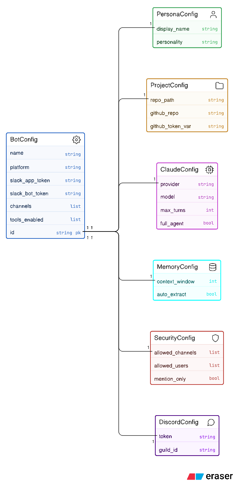</p>

### 3.6 Web UI (Next.js 16)

<p align="center">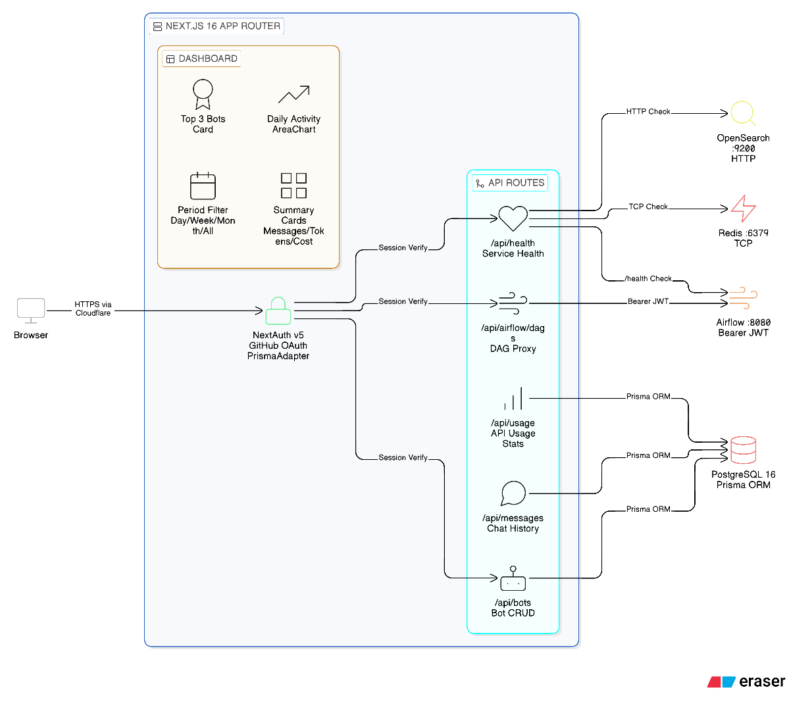</p>

- **인증**: NextAuth v5 + GitHub OAuth Provider. `PrismaAdapter`로 세션을 PostgreSQL에 저장합니다.
- **Airflow 프록시**: 매 요청마다 `/auth/token` 엔드포인트에서 JWT를 발급받아 `Authorization: Bearer` 헤더로 Airflow API를 호출합니다.
- **헬스 체크**: PostgreSQL, Redis, OpenSearch, Airflow 4개 서비스를 병렬(`Promise.allSettled`)로 확인합니다. 하나라도 실패하면 HTTP 503을 반환합니다.

### 3.7 Airflow DAGs

<p align="center">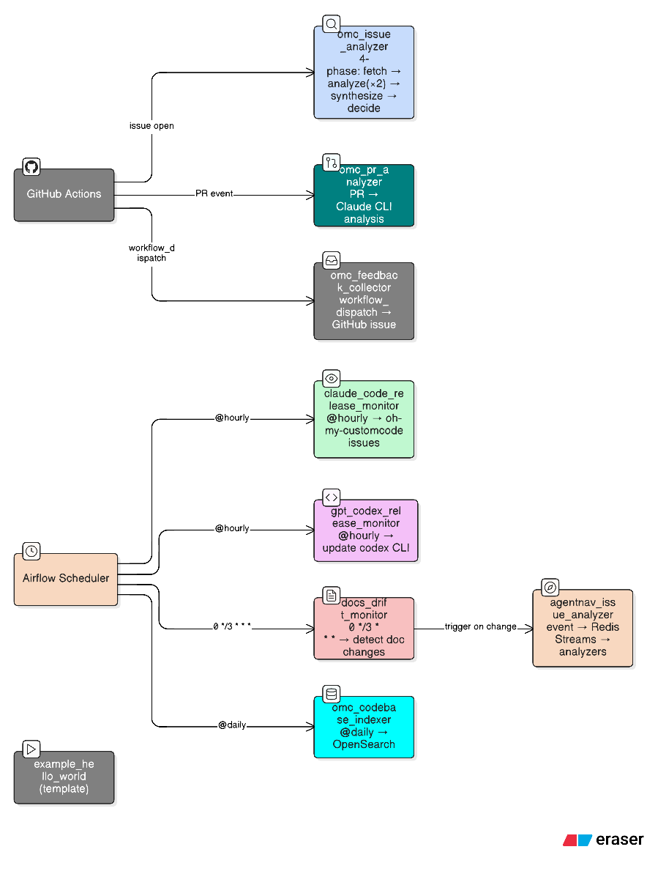</p>

| DAG | 트리거 | 역할 |
|-----|--------|------|
| `omc_issue_analyzer` | GitHub Actions webhook (SSH) / issue-comment-reeval.yml | GitHub 이슈를 4단계 파이프라인으로 분석: ① 아키텍트 + 동료 병렬 분석 → ② Professor 합성 → ③ Professor 판단(auto-dev/needs-input) → ④ omcustom-driver 자동 개발 |
| `claude_code_release_monitor` | 스케줄러 | anthropics/claude-code 새 릴리즈 감지 → oh-my-customcode에 트래킹 이슈 자동 생성 |
| `gpt_codex_release_monitor` | 스케줄러 | openai/codex 새 릴리즈 감지 → oh-my-customcode에 추적 이슈 생성, worker 컨테이너 Codex CLI 자동 업데이트 |
| `omc_codebase_indexer` | 스케줄러 | oh-my-customcode 코드베이스를 OpenSearch에 인덱싱 (RAG 검색용) |
| `omc_feedback_collector` | Airflow REST API / CLI | 사용자 피드백 수신, 검증 후 GitHub 이슈 생성 (익명 제출 지원) |
| `omc_pr_analyzer` | GitHub Actions 웹훅 (SSH) | PR 분석 요청을 Redis Stream에 발행, 분석 워커가 Claude CLI로 분석 수행. Redis 분산 락으로 중복 분석 방지 |
| `docs_drift_monitor` | `0 */3 * * *` (3시간 주기) | Claude Code·Codex·Gemini CLI 공식 문서 변경 감지 → GitHub docs-drift 이슈 생성 → agentnav_issue_analyzer 트리거 |
| `customclaw_issue_analyzer` | GitHub Actions webhook (SSH) | CustomClaw 자체 저장소의 GitHub 이슈를 분석하는 파이프라인. omc_issue_analyzer와 유사한 구조 |
| `example_hello_world` | 수동 / 스케줄러 | Airflow 동작 확인용 예제 DAG |

### 3.8 omcustom-driver (자동 개발 에이전트)

Professor가 `auto-dev` 판단을 내린 이슈에 한해 활성화되는 자동 개발 파이프라인입니다.

**동작 흐름:**

1. **Professor 게이트**: Professor가 `auto-dev` 라벨을 승인한 경우에만 실행
2. **진행 상황 공유**: GitHub 이슈 코멘트로 실시간 진행 상태 게시
3. **질문 처리**: 추가 정보가 필요한 경우 `needs-input` 라벨 부착 후 이슈 코멘트로 질문
4. **자동 개발**: 브랜치 생성 → 코드 구현 → 커밋 → 푸시 → PR 생성
5. **재평가**: 사용자가 `needs-input` 이슈에 답변하면 `issue-comment-reeval.yml` GitHub Actions가 분석을 재트리거

**worker 컨테이너 요구사항:**

omcustom-driver는 git 및 gh CLI가 필요합니다. worker 컨테이너 이미지에 두 도구가 포함되어 있습니다.

| 라벨 | 의미 |
|------|------|
| `auto-dev` | Professor가 자동 개발 승인 — omcustom-driver 활성화 |
| `needs-input` | 추가 정보 필요 — 사용자 답변 대기 중 |

**GitHub Actions 연동:**

- `oh-my-customcode` 저장소의 `issue-comment-reeval.yml`이 `needs-input` 라벨이 붙은 이슈에 새 코멘트가 달리면 SSH를 통해 `omc_issue_analyzer` DAG를 재트리거합니다.
- Analysis consumer는 xautoclaim 복구 기능을 갖추고 있어 재시작 시 메시지 유실을 방지합니다.

### 3.9 Analysis Worker (analysis_worker.py)

PR 분석 및 이슈 분석 요청을 처리하는 별도의 Redis Stream 컨슈머입니다.

- **Redis Stream**: `customclaw:analysis-requests` / Consumer Group: `analysis-workers`
- **기능**: Claude CLI를 subprocess로 호출하여 PR 정합성 분석 수행 (CLI 타임아웃: 10분)
- **GitHub 코멘트**: 분석 결과를 GitHub 이슈/PR 코멘트로 게시 (`_post_github_comment`)
- **중복 방지**: Redis `SET NX EX` 분산 락으로 동일 PR 15분 내 중복 분석 차단
- **복구**: `xautoclaim`으로 미확인 메시지 자동 복구 (idle timeout: 1분)

### 3.10 프로세스 관리 (supervisor.py / runtime_control.py)

`supervisor.py`는 worker/app 프로세스의 관리형 재시작을 지원하는 프로세스 슈퍼바이저입니다. `runtime_control.py`는 Redis 기반 안전한 자체 재시작 요청 헬퍼를 제공합니다.

- 재시작 요청은 Redis 키(`customclaw:control:restart`)를 통해 전달
- 종료 코드 75로 프로세스 종료 시 슈퍼바이저가 자동 재시작
- `CUSTOMCLAW_SUPERVISED` 환경 변수로 슈퍼바이저 모드 감지

### 3.11 GitHub Actions 워크플로우 (workflows/)

| 워크플로우 | 파일 | 설명 |
|-----------|------|------|
| Build & Push | `workflows/build-push.yml` | Docker 이미지 빌드 후 AWS ECR에 푸시 |
| Go CI | `workflows/go-ci.yml` | Go 코드 린트, 테스트 실행 |
| Issue Analyzer | `workflows/issue-analyzer.yml` | 이슈 이벤트 발생 시 SSH로 서버에 접속, 분석 DAG 트리거 |
| PR Analysis | `workflows/pr-analysis.yml` | PR 이벤트(opened, synchronize, ready_for_review) 발생 시 SSH로 서버에 접속, `omc_pr_analyzer` DAG 트리거 |
| PR Lifecycle | `workflows/pr-lifecycle.yml` | PR 라이프사이클 관리 (라벨링, 상태 추적) |
| Feedback Submission | `workflows/feedback-submission.yml` | 수동 `workflow_dispatch`로 피드백 제출. SSH로 `omc_feedback_collector` DAG 트리거 |

---

## 4. 데이터 흐름

### 전체 메시지 처리 흐름

```
1. [수신] 플랫폼 사용자 메시지 (Discord / Mattermost / Slack)
      → PlatformAdapter: 채널·사용자 권한 검증
      → Redis Stream xadd (customclaw:platform-messages)

2. [큐잉] Redis Stream
      → Consumer Group: customclaw-workers
      → Go Worker 인스턴스가 xreadgroup으로 할당 수신

3. [전처리] Worker
      → PostgreSQL: 사용자 메시지 저장 (messages 테이블)
      → PostgreSQL: 최근 대화 이력 조회 (context_window)
      → OpenSearch: 관련 기억 검색 (top_k=5, nori 키워드)

4. [AI 처리] Claude CLI / Codex CLI
      → limited mode:
           Phase 1: 프롬프트 → Claude → tool_call 감지
           (tool 호출 시) Phase 2: tool_result → Claude → 최종 응답
      → full_agent mode: 단일 프롬프트 → Claude (내장 도구 활용)
      → codex provider: codex exec → 메타데이터 파싱 → 순수 응답

5. [응답] 플랫폼 API (PlatformRegistry → ResponsePublisher)
      → 플랫폼별 메시지 전송 (thread 내 응답)
      → PostgreSQL: assistant 메시지 저장

6. [사후 처리] 비동기 메모리 추출
      → Claude haiku 호출 (source_message_id 연결)
      → fact/decision/preference/action/context 추출 (JSON)
      → PostgreSQL memories 테이블 저장 (source_message_id FK)
      → OpenSearch 인덱싱 (BM25 + 벡터 임베딩)
      → 스레드 레벨 추출 (컨텍스트 프리픽스 포함)
      → Redis xack (메시지 확인 처리)

7. [CDC] 메시지 삭제/수정 이벤트 처리
      → 삭제: source_message_id로 연관 메모리 추적 → OS + PG 삭제 → 캐시 무효화
      → 수정: DB 내용 업데이트 → stale 메모리 무효화 → 다음 추출 사이클에서 재생성
```

---

## 5. 데이터베이스 스키마

<p align="center">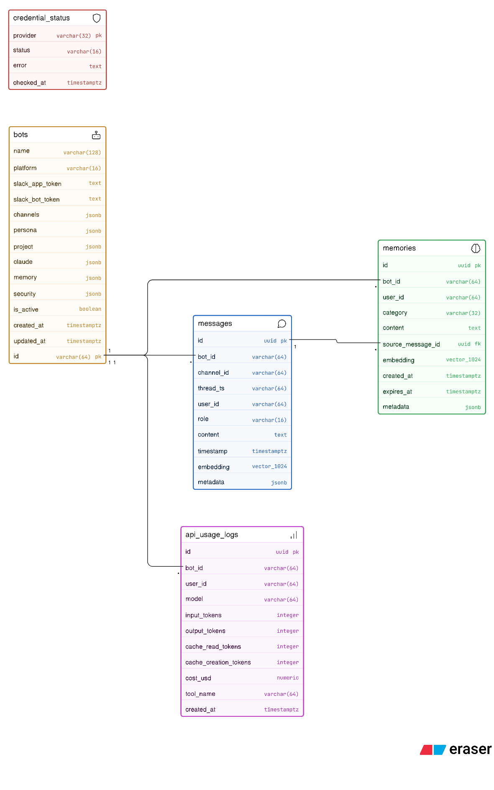</p>

### 테이블별 설명

| 테이블 | 목적 | 주요 인덱스 |
|--------|------|------------|
| `messages` | 모든 대화 메시지 저장 (soft delete 지원). `deleted_at`, `edited_at`, `original_content` 컬럼으로 삭제/수정 이력 추적 | `(bot_id, channel_id, thread_ts)`, `(bot_id, platform_message_id)`, HNSW cosine 임베딩 |
| `memories` | 자동 추출된 장기 기억. `source_message_id`로 원본 메시지 연결. BM25 + kNN 하이브리드 검색. CDC 삭제/수정 cascade 지원 | `(bot_id)`, `(source_message_id)`, `(embedding_version)`, HNSW cosine 임베딩 |
| `bots` | 봇 설정 원장. Web UI에서 CRUD. platform-adapter는 YAML을 우선 사용 | Primary Key(id) |
| `api_usage_logs` | LLM API 호출 비용 추적 | `(bot_id, created_at)` |

**OpenSearch 인덱스 (`customclaw-memories`):**
- alias `customclaw-memories` → 버전별 인덱스 `customclaw-memories-v{N}` (Blue-Green 무중단 재인덱싱)
- `content` 필드: nori 커스텀 analyzer (nori_tokenizer + nori_readingform + lowercase) — BM25 키워드 검색
- `content_vector` 필드: 1024차원 float 벡터 — kNN 유사도 검색 (OpenAI text-embedding-3-small)
- `bot_id`, `category`, `user_id`: keyword 타입 (정확 매칭 필터)
- `embedding_version`, `embedded_at`: 임베딩 모델 버전 추적 (재임베딩 시 사용)

---

## 6. 인프라

### Docker Compose 서비스 맵

<p align="center">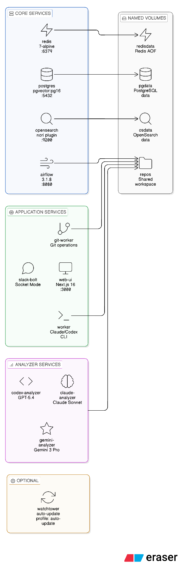</p>

### 서비스 의존 관계

<p align="center">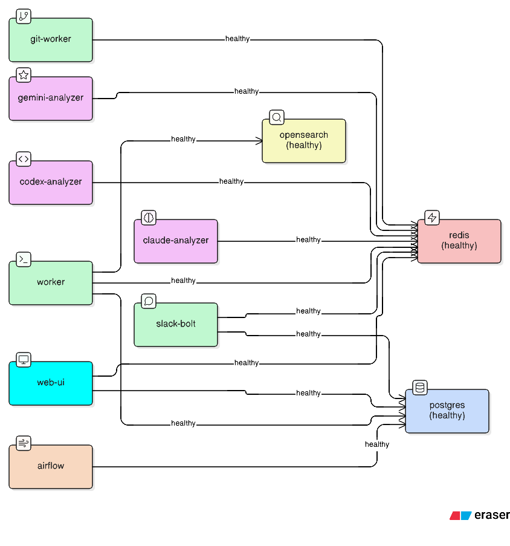</p>

### 서비스 현황

Docker 이미지는 AWS ECR (`849376369259.dkr.ecr.ap-northeast-2.amazonaws.com/customclaw/`)에서 관리됩니다.

| 서비스 | 이미지 | 상태 | 비고 |
|--------|--------|------|------|
| postgres | pgvector/pgvector:pg16 | **Active** | |
| opensearch | customclaw/opensearch:develop (ECR) | **Active** | |
| redis | redis:7-alpine | **Active** | |
| airflow | customclaw/airflow:develop (ECR) | **Active** | |
| web-ui | customclaw/web-ui:develop (ECR) | **Active** | |
| go-worker | go/Dockerfile (로컬 빌드) | **Active (Primary)** | `docker-compose.go-shadow.yml` |
| cli-keeper | docker/cli-keeper/Dockerfile (로컬 빌드) | **Active** | CLI 토큰 갱신·업데이트 사이드카 |
| platform-adapter | customclaw/platform-adapter:develop (ECR) | Profiled out (`profiles: [slack]`) | 플랫폼 어댑터 (Renamed from slack-bolt in v1.0.0) |
| worker (Python) | customclaw/platform-adapter:develop (ECR) | Profiled out (`profiles: [legacy]`) | Deprecated |
| claude-analyzer | customclaw/platform-adapter:develop (ECR) | Profiled out (`profiles: [slack]`) | docs drift 분석 |
| codex-analyzer | customclaw/platform-adapter:develop (ECR) | Profiled out (`profiles: [slack]`) | docs drift 분석 |
| gemini-analyzer | customclaw/platform-adapter:develop (ECR) | Profiled out (`profiles: [slack]`) | docs drift 분석 |
| watchtower | nickfedor/watchtower | Profiled out (`profiles: [auto-update]`) | 자동 이미지 업데이트 |
| go-app | go/Dockerfile (로컬 빌드) | Profiled out (`profiles: [go-full]`) | Go App 서버 |

### 헬스체크

| 서비스 | 헬스체크 방식 |
|--------|--------------|
| postgres | `pg_isready -U ${DB_USER}` |
| opensearch | `curl -sf http://localhost:9200/_cluster/health?wait_for_status=yellow` |
| redis | `redis-cli ping` |
| airflow | `curl -sf http://localhost:8080/` |
| web-ui | `node -e "fetch('http://localhost:3000')..."` |
| go-worker | `kill -0 1` (프로세스 존재 확인) |
| platform-adapter / analyzers | Redis 연결 확인 (Python socket connect) |

### 주요 볼륨 마운트

| 볼륨/경로 | 서비스 | 목적 |
|-----------|--------|------|
| `./bots:/app/bots` | go-worker, platform-adapter | 봇 YAML 설정 파일 실시간 반영 |
| `${HOST_WORKSPACE_PATH}:${CONTAINER_HOME}/workspace` | go-worker, airflow | Git 리포지토리 공유 |
| `${CLAUDE_CONFIG_DIR}:${CONTAINER_HOME}/.claude` | go-worker | Claude CLI 설정·인증 |
| `${CLAUDE_CREDENTIALS_FILE}:${CONTAINER_HOME}/.claude.json` | go-worker | Claude CLI 자격증명 |
| `${CLAUDE_CLI_BINARY}:/usr/local/bin/claude:ro` | go-worker, airflow | Claude CLI 바이너리 |
| `${CODEX_PKG_DIR}/.../codex:/usr/local/bin/codex:ro` | go-worker | Codex CLI 바이너리 (static Rust binary) |
| `./dags:/opt/airflow/dags` | airflow | DAG 파일 핫 리로드 |
| `./migrations:/docker-entrypoint-initdb.d` | postgres | 초기화 SQL 자동 실행 |

---

## 7. 배포 아키텍처

<p align="center">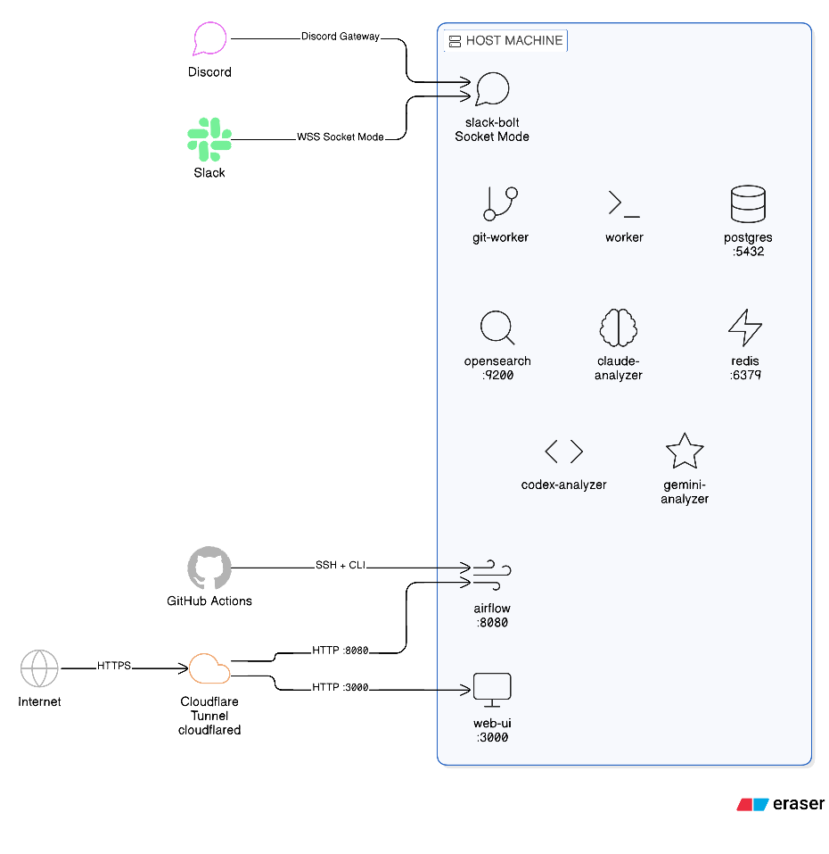</p>

### 포트 매핑

| 서비스 | 호스트 포트 | 컨테이너 포트 | 외부 노출 |
|--------|------------|--------------|----------|
| postgres | 5432 | 5432 | 아니오 (내부 전용) |
| opensearch | - | 9200 | 아니오 (내부 전용) |
| redis | - | 6379 | 아니오 (내부 전용) |
| airflow | 8080 | 8080 | 아니오 (내부 + SSH) |
| web-ui | 3000 | 3000 | Cloudflare Tunnel 경유 |

### 환경 변수 요약

| 변수 | 서비스 | 설명 |
|------|--------|------|
| `DATABASE_DSN` | go-worker, platform-adapter | PostgreSQL 연결 문자열 |
| `REDIS_URL` | 전체 | Redis 연결 URL |
| `OPENSEARCH_URL` | go-worker | OpenSearch 엔드포인트 |
| `OPENSEARCH_ADMIN_PASSWORD` | opensearch | OpenSearch 초기 관리자 비밀번호 |
| `ANTHROPIC_API_KEY` | airflow | Claude API 인증 |
| `VOYAGE_API_KEY` | (미사용) | 임베딩 API (미래 pgvector 활성화용) |
| `ENCRYPTION_KEY` | platform-adapter | 토큰 암호화 키 |
| `GITHUB_TOKEN` | go-worker, airflow | GitHub API 인증 |
| `AIRFLOW_API_URL` | web-ui | Airflow REST API 엔드포인트 |
| `NEXTAUTH_URL` | web-ui | NextAuth 콜백 기본 URL |
| `GITHUB_CLIENT_ID/SECRET` | web-ui | GitHub OAuth 앱 자격증명 |

---

## 8. 주요 설계 결정 및 트레이드오프

| 결정 | 이유 | 트레이드오프 |
|------|------|------------|
| Redis Stream (Consumer Group) | 멀티 Worker 수평 확장, at-least-once 처리 보장 | xack 전 장애 시 메시지 재처리 가능성 |
| Claude CLI subprocess | API SDK 없이 최신 Claude CLI 기능(full_agent, tools) 바로 활용 | subprocess 오버헤드, 프로세스 관리 복잡도 |
| 2-Phase Prompt (limited mode) | JSON tool_call 파싱으로 도구 호출 제어 | Phase 2 추가 LLM 호출 비용 |
| pgvector + OpenSearch 하이브리드 | 시맨틱(벡터) + 키워드(nori) 검색 상호 보완 | OpenSearch 메모리 부담, 동기화 복잡도 |
| YAML 봇 설정 (우선) + DB (보조) | 파일 기반 빠른 배포, DB로 Web UI 관리 지원 | 두 소스 간 동기화 일관성 주의 필요 |
| Codex provider | Claude 대비 GPT-5.4 모델 옵션 추가 | 메타데이터 파싱 추가 구현 필요 |
| 멀티플랫폼 어댑터 (Discord / Mattermost / Slack) | 단일 인프라에서 플랫폼별 봇 운영, Discord `mention_only` 등 플랫폼 특화 옵션 지원 | 플랫폼별 어댑터 유지보수 필요 |
| PlatformRegistry 패턴 | 플랫폼 추가/제거 시 중앙 코드 변경 불필요, NoOp 폴백으로 안전한 degradation | 런타임 등록 순서에 의존 |
| Go worker (primary) | Python 대비 낮은 메모리 사용, 빠른 시작 시간, 타입 안전성 | Python 코드베이스와 이중 유지보수 (마이그레이션 완료 시까지) |
| AWS ECR 이미지 관리 | 프라이빗 이미지 저장소, Watchtower 자동 업데이트 연동 | ECR 인증 관리 필요 |
| 전용 analyzer 컨테이너 (claude/codex/gemini) | docs drift 분석을 CLI별 독립 컨테이너로 분리, Redis Stream 기반 비동기 처리 | 컨테이너 수 증가, CLI별 자격증명 볼륨 마운트 필요 |
